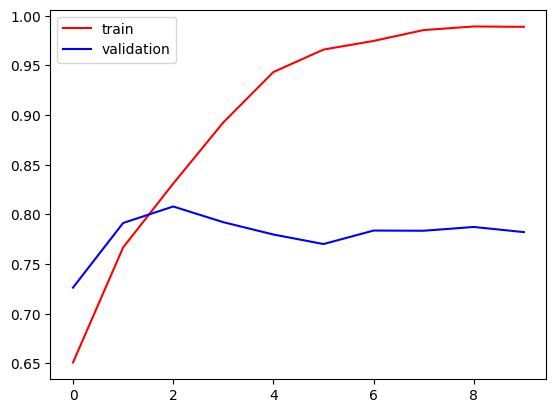
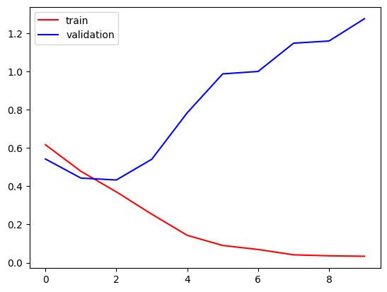
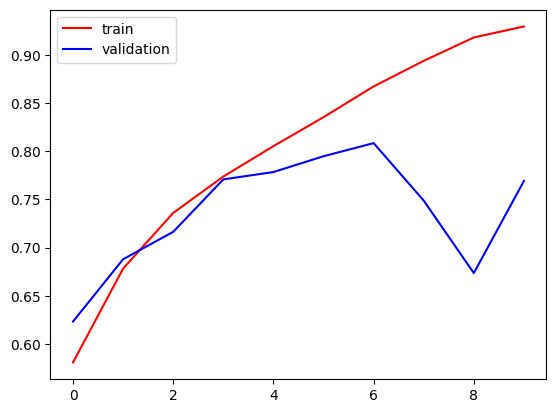
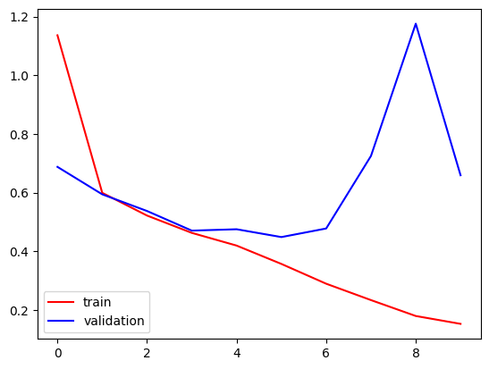

# accuracy graph before optimization

# loss graph between train and validation before optimization

# accuracy graph after optimization

# loss graph between train and validation after optimization

